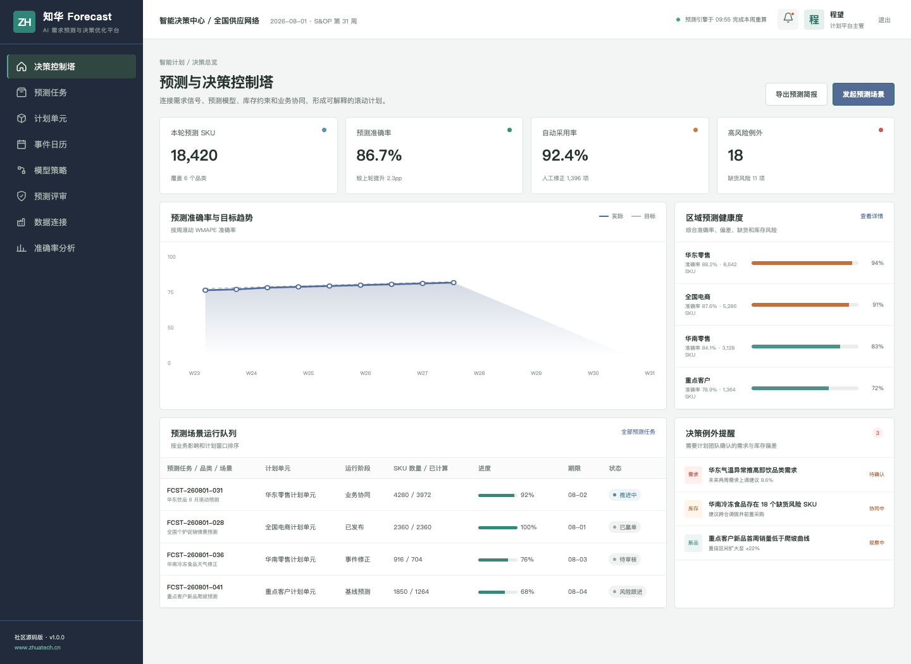

# 让预测成为可解释、可协同的企业计划基线

## ZhuaTech Forecast｜知华科技 AI 需求预测与决策优化平台

[知华科技（上海如静知华信息科技有限公司）](https://www.zhuatech.cn/)发布的非商业社区源码项目，适用于需求计划、S&OP、库存优化、采购与产能协同的技术学习和方案验证。



### 从数据到决策

平台组合历史销量、价格、促销、节假日、天气和业务事件，支持多模型预测、置信区间、例外管理、人工修正及 Forecast Value Add 复盘。每次修正均保留模型原值、调整依据、责任人和审批记录。

| 能力域 | 主要能力 |
| --- | --- |
| 数据准备 | 缺失处理、异常检测、层级聚合、事件编码 |
| 模型运行 | 基线模型、机器学习、集成选择、回测 |
| 业务协同 | 例外驱动、业务修正、评审与版本冻结 |
| 决策优化 | 缺货、积压、产能和供应约束模拟 |
| 持续评估 | WMAPE、Bias、FVA、稳定性与漂移 |


情景测算接口把趋势、季节指数、促销提升和模型置信度转换为基线、下行与上行需求区间。低置信度或区间波动较大的预测会明确标记为业务复核，帮助计划员在冻结版本前识别高风险 SKU。

### 快速体验

```bash
cd frontend
npm install
npm run dev:demo
```

打开 `http://localhost:5173`，使用 `planner / Demo@2026` 进入决策控制塔，或使用 `operator / Demo@2026` 进入计划员工作台。Docker 全栈启动方式见 [部署指南](deploy/README.md)。

工程采用 Java 21 + Spring Boot + Vue 3 + MySQL 8，后端包名 `cn.zhuatech.forecast`。模型能力通过 `AiProvider` 扩展，演示实现仅返回安全示例结果，不包含第三方模型密钥。

### 非商业许可

本工程仅限个人学习、研究和非商业技术交流，**禁止商用**。企业部署、生产使用、咨询交付、SaaS、收费培训、品牌替换或商业传播须取得上海如静知华信息科技有限公司书面授权，详见 [LICENSE](LICENSE)。

深度开发与商业授权：[知华科技官网](https://www.zhuatech.cn/)

| 微信咨询一 | 微信咨询二 |
| --- | --- |
|  |  |

SEO 关键词：需求预测系统源码、AI 预测平台、S&OP、库存优化、Forecast Value Add、Java 预测系统、知华科技。

## 预测偏差监控

新增 `POST /api/forecast/insights/bias-monitor`，按周期计算预测偏差、MAPE 和持续高估次数，输出 `STABLE`、`WATCH` 或 `RECALIBRATE` 及参数调整建议。
